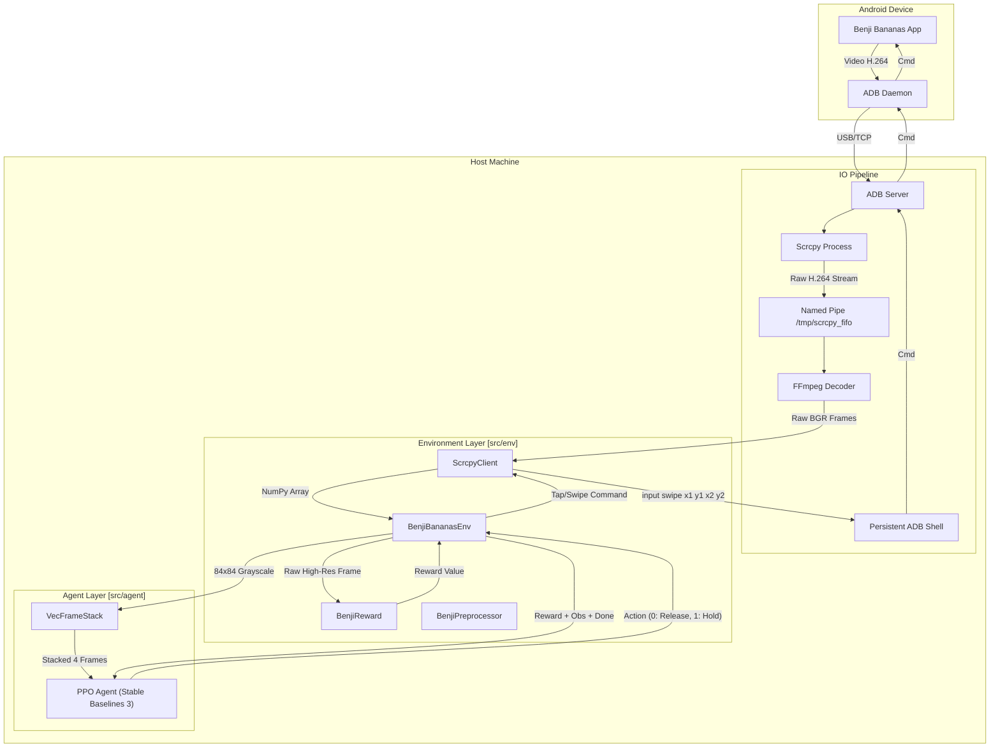

# System Architecture

## Overview
The `benji-rl` project implements a Reinforcement Learning system to play *Benji Bananas* on an Android device. The architecture is designed for low-latency observation streaming and action execution, enabling an agent to learn from raw pixels in real-time.

## Architecture Diagram

## Component Breakdown

### 1. IO Pipeline (Low-Latency Bridge)
The critical foundation of the project is the ability to stream visuals and inject controls with minimal delay.
-   **Scrcpy & FIFO**: Instead of standard variable-latency screen capture, `scrcpy` streams raw H.264 video to a Linux Named Pipe (FIFO). This prevents buffering deadlocks and isolates the video stream from log noise.
-   **FFmpeg**: Reads the FIFO and decodes the stream into raw BGR pixel data, which Python reads directly into NumPy arrays.
-   **Persistent ADB Shell**: To beat the 100ms latency of standard `adb shell` commands, a persistent subprocess keeps a shell open, allowing commands to be piped instantly (`stdin`), reducing input latency to ~0.14ms.

### 2. Environment Layer (`src/env`)
This layer implements the `gymnasium` interface (`reset`, `step`).
-   **`BenjiBananasEnv`**: The main class orchestration the loop.
    -   **State**: Manages connection status and "holding" state (for swing mechanics).
    -   **Game Over Detection**: Uses template matching on specific regions to detect death screens and automatically restart the game.
-   **`BenjiReward`**: Calculates rewards using a hybrid approach:
    -   **OCR**: Upscales and thresholds the score ROI to read "Distance" and "Bananas" using Tesseract.
    -   **Physics**: Adds rewards for visual momentum (optical flow approximation) to encourage movement.
-   **`BenjiPreprocessor`**: Prepares frames for the CNN.
    -   Converts to Grayscale.
    -   Resizes to 84x84 pixels.

### 3. Agent Layer (`src/agent`)
This layer handles the learning and decision making.
-   **Wrappers**:
    -   `VecTransposeImage`: Ensures the channel dimension comes first (CHW) for PyTorch.
    -   `VecFrameStack`: Stacks the last 4 frames to give the agent a sense of velocity and acceleration.
-   **Model**:
    -   **Algorithm**: Proximal Policy Optimization (PPO) from `stable-baselines3`.
    -   **Policy**: `CnnPolicy` (NatureCNN architecture).
    -   **Training**: Runs for N timesteps, saving checkpoints periodically.

## Data Flow Summary
1.  **Observation**: The Android device renders a frame -> Streamed via Scrcpy/FFmpeg -> Preprocessed to 84x84x4 stack.
2.  **Decision**: The PPO Network infers an action (Hold or Release).
3.  **Action**: The action is converted to a touch event (Swipe to hold, release finger to stop) and injected via ADB.
4.  **Feedback**: The environment calculates the reward based on the score change (OCR) and updates the agent.
